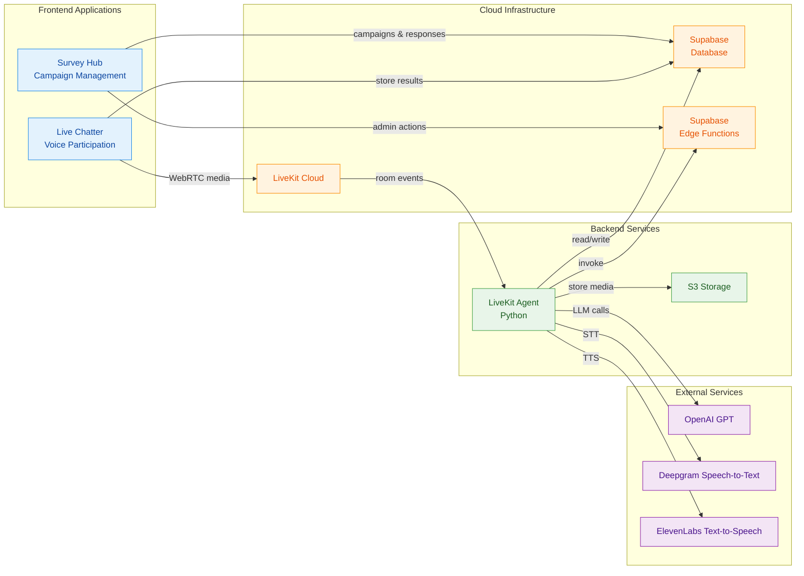
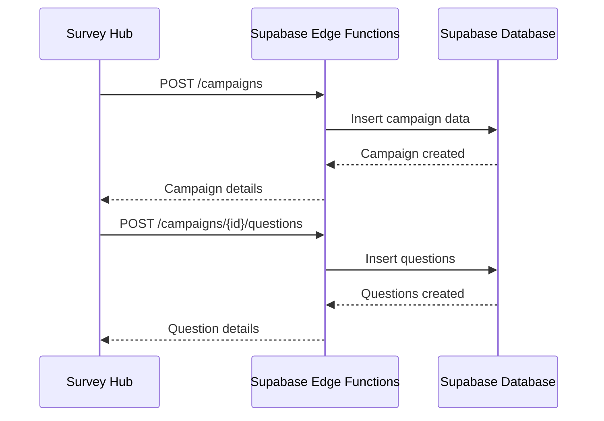
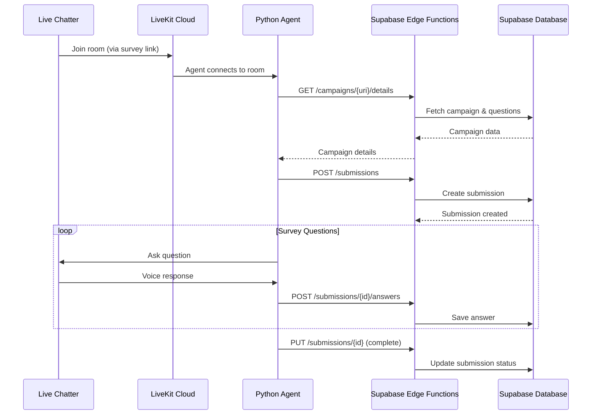
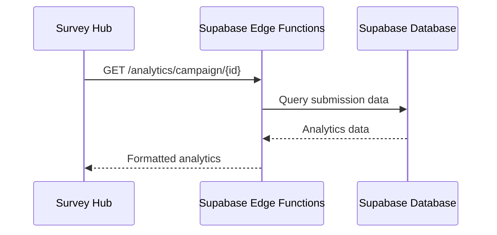
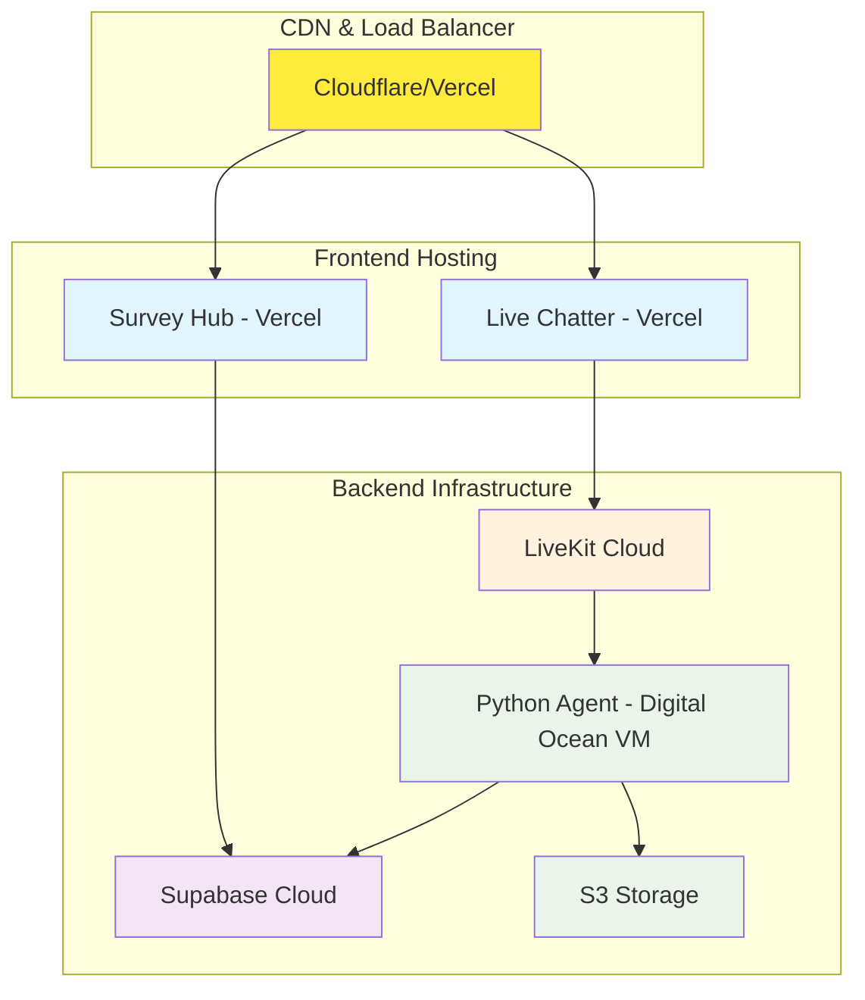

# Voice Survey Solution - Complete Architecture Design

## 🎯 Overview

A comprehensive voice survey platform that enables real-time voice conversations with AI agents, campaign management, and analytics. The solution integrates LiveKit Cloud for real-time communication, Python agents for intelligent conversation handling, Supabase for data persistence, and React frontends for user management and participation.

## 🏗️ System Architecture



## 📱 Frontend Applications

### 1. Survey Hub (Campaign Management)
**Location**: `apps/survey-hub/`
**Purpose**: Admin interface for creating and managing voice survey campaigns

**Key Features**:
- 🔐 **Authentication**: Supabase Auth integration
- 📊 **Campaign Management**: Create, edit, and manage survey campaigns
- ❓ **Question Builder**: Dynamic question creation with ordering
- 📈 **Analytics Dashboard**: Real-time survey completion metrics
- 👥 **Invitation System**: Generate unique links for participants
- 📋 **Response Management**: View and export survey responses

**Tech Stack**:
- React + TypeScript + Vite
- Tailwind CSS + shadcn/ui
- React Query for data fetching
- React Router for navigation

### 2. Live Chatter (Voice Participation)
**Location**: `apps/live-chatter/`
**Purpose**: Voice interface for survey participants

**Key Features**:
- 🎤 **Voice Interface**: Real-time voice conversation with AI
- 🔗 **Campaign Links**: Join via unique survey links
- 📱 **Mobile Optimized**: Responsive design for mobile devices
- 🎧 **Audio Controls**: Mute, volume, and connection status
- 📊 **Progress Tracking**: Visual survey completion progress
- 🔄 **Session Management**: Resume interrupted surveys

**Tech Stack**:
- React + TypeScript + Vite
- LiveKit Web SDK
- Tailwind CSS + shadcn/ui
- React Query for state management

## ☁️ Cloud Infrastructure

### 1. LiveKit Cloud
**Purpose**: Real-time communication infrastructure

**Key Components**:
- **Room Management**: Dynamic room creation for each survey session
- **WebRTC Signaling**: Handles real-time audio/video streaming
- **Connection Management**: Manages participant connections
- **Agent Integration**: Routes calls to Python agents

**Configuration**:
```typescript
// apps/live-chatter/src/config/livekit.ts
export const LIVEKIT_CONFIG = {
  url: process.env.VITE_LIVEKIT_URL,
  apiKey: process.env.VITE_LIVEKIT_API_KEY,
  apiSecret: process.env.VITE_LIVEKIT_API_SECRET
}
```

### 2. Supabase Database
**Purpose**: Centralized data storage and management

**Core Tables**:
```sql
-- Campaign Management
campaign (
  id, name, intro_prompt, greeting, 
  purpose_explanation, campaign_uri, 
  created_at, updated_at
)

-- Survey Questions
question (
  id, campaign_id, question_text, 
  question_order, question_type, 
  created_at
)

-- Survey Submissions
survey_submissions (
  id, campaign_id, room_name, 
  user_profile_id, status, s3_recording_url,
  started_at, completed_at, created_at
)

-- Survey Answers
survey_answers (
  id, submission_id, question_id, 
  answer_text, answer_audio_url, 
  created_at
)

-- Campaign Links & Invitations
campaign_links (
  id, campaign_id, link_token, 
  is_anonymous, max_uses, used_count,
  expires_at, created_at
)

-- Room Pattern Mapping
campaign_room_mapping (
  id, campaign_id, room_pattern, 
  is_active, created_at
)
```

### 3. Supabase Edge Functions
**Purpose**: Serverless API endpoints for data operations

**Key Endpoints**:
```typescript
// Campaign Management
GET /campaigns/{campaign_uri}/details?token={link_token}
POST /campaigns
PUT /campaigns/{id}

// Survey Submissions
POST /submissions
GET /submissions?room_name={room_name}
PUT /submissions/{id}

// Survey Answers
POST /submissions/{id}/answers
GET /submissions/{id}/answers

// Analytics
GET /analytics/campaign/{id}
GET /analytics/overview
```

## 🤖 Backend Services

### 1. LiveKit Agent (Python)
**Location**: `services/livekit-agent/`
**Deployment**: Digital Ocean VM
**Purpose**: AI-powered voice conversation agent

**Key Features**:
- 🧠 **Dynamic Prompting**: Loads campaign-specific prompts and questions
- 🎯 **Campaign Routing**: Routes calls based on room name patterns
- 💾 **Data Persistence**: Saves responses via API calls
- 🎙️ **Audio Processing**: Handles speech-to-text and text-to-speech
- 📹 **Recording**: Automatic call recording to S3
- 🔄 **Session Management**: Handles multiple concurrent sessions

**Core Components**:
```python
# services/livekit-agent/main.py
class SurveyAgent(Agent):
    async def on_connect(self, session: AgentSession):
        # Load campaign data based on room name
        # Initialize conversation flow
        
    async def on_message(self, message: str):
        # Process user input
        # Generate AI response
        # Save answers to database
        
    async def on_disconnect(self):
        # Finalize survey submission
        # Upload recording to S3
```

**API Integration**:
```python
# services/livekit-agent/api_client.py
class SurveyAPIClient:
    async def get_campaign_details(self, campaign_uri: str, token: str)
    async def create_submission(self, campaign_id: int, room_name: str)
    async def save_answer(self, submission_id: int, question_id: int, answer: str)
    async def update_submission(self, submission_id: int, s3_url: str)
```

### 2. S3 Storage
**Purpose**: Audio recording and file storage

**Storage Structure**:
```
s3://voice-surveys/
├── recordings/
│   ├── campaign-1/
│   │   ├── room-123-2024-01-15.mp3
│   │   └── room-456-2024-01-15.mp3
│   └── campaign-2/
│       └── room-789-2024-01-15.mp3
└── audio-snippets/
    ├── answers/
    └── prompts/
```

## 🔄 Data Flow

### 1. Campaign Creation Flow


### 2. Survey Participation Flow


### 3. Analytics Flow


## 🔧 Configuration & Environment

### Environment Variables
```bash
# LiveKit Configuration
LIVEKIT_URL=wss://your-project.livekit.cloud
LIVEKIT_API_KEY=your_api_key
LIVEKIT_API_SECRET=your_api_secret

# Supabase Configuration
SUPABASE_URL=https://your-project.supabase.co
SUPABASE_ANON_KEY=your_anon_key
SUPABASE_SERVICE_ROLE_KEY=your_service_role_key

# OpenAI Configuration
OPENAI_API_KEY=your_openai_key

# AWS S3 Configuration
AWS_ACCESS_KEY_ID=your_access_key
AWS_SECRET_ACCESS_KEY=your_secret_key
AWS_S3_BUCKET=voice-surveys

# Deepgram Configuration
DEEPGRAM_API_KEY=your_deepgram_key

# ElevenLabs Configuration
ELEVENLABS_API_KEY=your_elevenlabs_key
```

## 🚀 Deployment Architecture

### Production Setup


## 📊 Monitoring & Analytics

### Key Metrics
- **Survey Completion Rate**: Percentage of started surveys that are completed
- **Average Session Duration**: Time spent in voice conversations
- **Question Response Rate**: Percentage of questions answered
- **Agent Performance**: Response time and accuracy metrics
- **System Uptime**: LiveKit and agent availability

### Logging Strategy
```python
# services/livekit-agent/main.py
logging.basicConfig(
    level=logging.INFO,
    format='%(asctime)s - %(name)s - %(levelname)s - %(message)s',
    handlers=[
        logging.StreamHandler(),
        logging.FileHandler('survey_agent.log')
    ]
)
```

## 🔒 Security Considerations

### Authentication & Authorization
- **Supabase Auth**: JWT-based authentication for admin users
- **API Security**: Service role keys for agent-to-API communication
- **Room Security**: LiveKit room tokens with expiration
- **Data Encryption**: All data encrypted in transit and at rest

### Data Privacy
- **GDPR Compliance**: User consent and data deletion capabilities
- **PII Protection**: Sensitive data encryption and anonymization
- **Audit Logging**: Complete audit trail of all data operations
- **Access Controls**: Role-based access to survey data

## 🎯 Next Steps & Roadmap

### Phase 1: Core Implementation ✅
- [x] Basic LiveKit integration
- [x] Python agent with OpenAI integration
- [x] Supabase database schema
- [x] Basic React frontends

### Phase 2: Enhanced Features 🚧
- [ ] Advanced analytics dashboard
- [ ] Multi-language support
- [ ] Custom voice models
- [ ] Survey templates

### Phase 3: Scale & Optimize 📋
- [ ] Multi-region deployment
- [ ] Advanced caching strategies
- [ ] Real-time collaboration features
- [ ] Mobile app development

## 📚 Documentation & Resources

- **API Documentation**: `/docs/api-reference.md`
- **Deployment Guide**: `/docs/deployment.md`
- **Development Setup**: `/docs/development.md`
- **Troubleshooting**: `/docs/troubleshooting.md`

---

This architecture provides a scalable, secure, and user-friendly voice survey platform that can handle multiple campaigns, concurrent users, and provides comprehensive analytics for survey creators.
