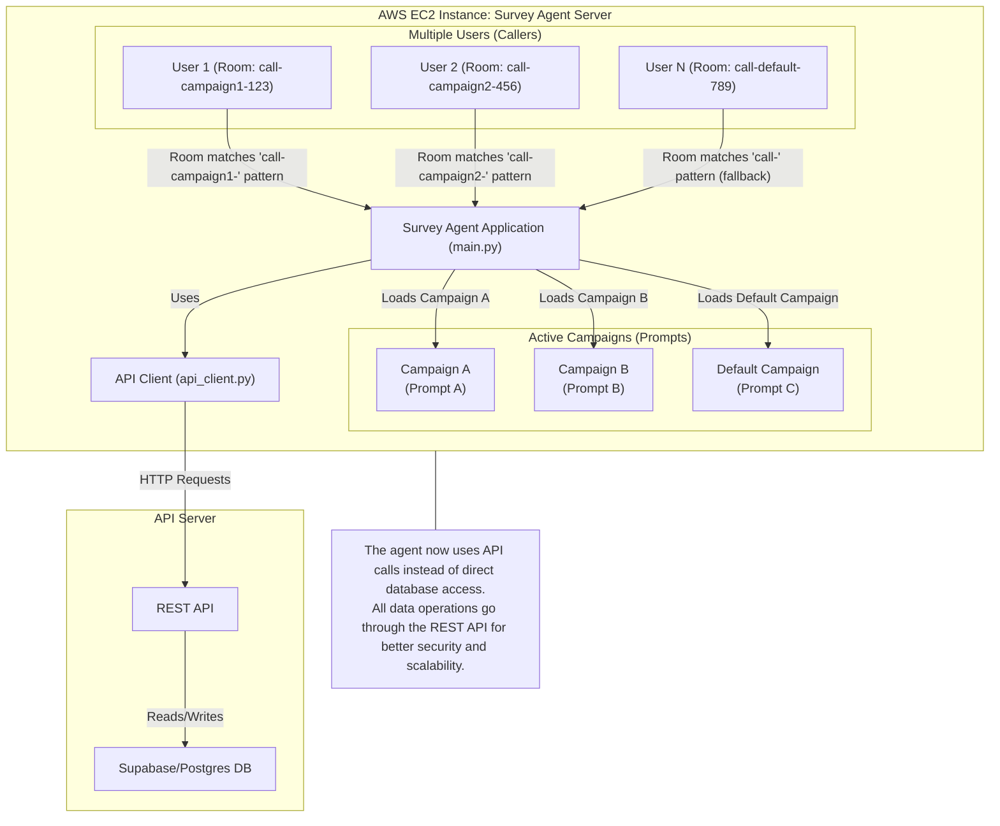

# deploy AWS or Digital Ocean

```sh
# install Docker:
sudo apt update && sudo apt install -y docker.io
sudo usermod -aG docker $USER
newgrp docker

git clone https://github.com/fbellame/futures_survey.git

cd futures_survey

nano .env
#copier coller les variables d'env

# build and run docker image future-survey
docker build -t future-survey .

# with docker without systemd (for test)
docker run -p 8081:8081 --env-file .env future-survey

## with systemd (more stable because survive VM reboot)
cp livekit-agent-compose@.service /etc/systemd/system/

# add env variables
nano /etc/livekit-agent.env
nano /etc/datadog.env

# launch and monitor logs
sudo systemctl daemon-reload
sudo systemctl enable --now livekit-agent-compose@1
docker logs -f livekit-agent-1
docker logs -f dd-agent

```

# Multi-Campaign Survey Agent Architecture

This project allows you to deploy a survey agent on an AWS EC2 instance that can serve multiple users, each participating in different campaigns (with different prompts and questions). The agent dynamically loads the relevant campaign and questions for each user session based on the room name, and stores all call and answer data through a REST API (with Supabase/Postgres backend).

## 🚀 New API-Based Architecture

The system has been refactored to use a REST API instead of direct database calls, providing:

- **Better Security**: API authentication and authorization
- **Improved Scalability**: API can be scaled independently
- **Anonymous Surveys**: Support for generic links without user registration
- **Async Operations**: Non-blocking API calls for better performance
- **Flexible Integration**: Easy integration with external applications

## How It Works
- **Multiple users** can call in simultaneously.
- Each user is routed to the correct campaign (prompt) based on the room name pattern.
- The agent loads the relevant prompt/questions from the database for each session.
- All call records and answers are stored in the database, which holds all campaign/question data.

## Campaign Selection by Room Name

The system now supports campaign selection based on room name patterns:

1. **Room Name Patterns**: You can map specific room name patterns to campaigns
   - Example: `call-campaign1-` → Campaign A
   - Example: `call-campaign2-` → Campaign B
   - Example: `call-` → Default Campaign (fallback)

2. **Fallback Mechanism**: If no specific pattern matches, the system falls back to the most recent campaign.

## Setup Instructions

### 1. API Configuration
Set up your Supabase environment variables:

```bash
# Required Supabase configuration
SUPABASE_URL=https://your-project.supabase.co
SUPABASE_KEY=your_supabase_anon_key  # Store anon key in SUPABASE_KEY

# No optional variables needed - all operations go through Edge Functions API
```

### 2. Install Dependencies
Add the new API client dependency:

```bash
pip install aiohttp
```

### 3. Database Schema
Run the updated schema in `supabase_schema_fixed.sql` which includes:
- New `campaign_room_mapping` table for mapping room patterns to campaigns
- Updated `survey_submissions` table with API support
- Support for anonymous surveys with `is_anonymous` flag

### 4. Campaign Room Mappings
Use the setup script to create mappings:

```bash
python setup_campaign_mappings.py
```

This script allows you to:
- List all available campaigns
- Set up default mappings
- Create custom room pattern mappings

### 5. Test API Integration
Run the test script to verify your Supabase Edge Function configuration:

```bash
python test_api_integration.py
```

### 3. Example Room Name Patterns
- `call-` → Default campaign (fallback)
- `call-campaign1-` → Campaign 1
- `call-campaign2-` → Campaign 2
- `call-survey-a-` → Survey A Campaign

## Architecture Diagram



## API Endpoints

The system now uses the following Supabase Edge Function endpoints:

### Campaign Management
- `GET /functions/v1/survey-api/campaigns/{campaign_uri}/details?token={link_token}` - Get campaign details and questions

### Submission Management
- `POST /functions/v1/survey-api/submissions` - Create new survey submission
- `GET /functions/v1/survey-api/submissions?room_name={room_name}` - Get existing submission by room name
- `PUT /functions/v1/survey-api/submissions/{submission_id}` - Update submission (e.g., S3 URL)

### Answer Management
- `POST /functions/v1/survey-api/submissions/{submission_id}/answers` - Submit answers
- `GET /functions/v1/survey-api/submissions/{submission_id}/answers` - Get existing answers

### Example URLs
Based on your Supabase project, the full URLs would be:
- `https://rpgpwailndlmpgufmfzi.supabase.co/functions/v1/survey-api/campaigns/{campaign_uri}/details?token={link_token}`
- `https://rpgpwailndlmpgufmfzi.supabase.co/functions/v1/survey-api/submissions`

## Database Schema Changes

The updated schema includes:

1. **campaign_room_mapping** table:
   - Maps room name patterns to specific campaigns
   - Supports active/inactive mappings
   - Enables flexible routing

2. **survey_submissions** table updates:
   - Added `room_name` field for tracking
   - Support for anonymous submissions with `user_profile_id` as null
   - Better submission history and analytics

3. **campaign_links** table updates:
   - Added `is_anonymous` flag for anonymous surveys
   - Support for generic links without user registration

## Usage Examples

### Creating Multiple Campaigns
```python
# Create different campaigns
campaign1_id = create_campaign(
    name="Customer Satisfaction Survey",
    intro_prompt="You are conducting a customer satisfaction survey...",
    greeting="Hello, thank you for participating in our customer survey."
)

campaign2_id = create_campaign(
    name="Product Feedback Survey", 
    intro_prompt="You are conducting a product feedback survey...",
    greeting="Hello, thank you for providing product feedback."
)
```

### Setting Up Room Mappings
```python
# Map room patterns to campaigns
create_campaign_room_mapping(campaign1_id, "call-satisfaction-")
create_campaign_room_mapping(campaign2_id, "call-feedback-")
create_campaign_room_mapping(default_campaign_id, "call-")  # fallback
```

## Migration Guide

If you're upgrading from the previous database-based approach, see the [Migration Guide](MIGRATION_GUIDE.md) for detailed instructions.

## Documentation

- [API Integration Guide](API_INTEGRATION.md) - Details about the new API endpoints
- [API Configuration Guide](API_CONFIGURATION.md) - Setup and configuration instructions
- [Migration Guide](MIGRATION_GUIDE.md) - How to migrate from database to API approach

---

For more details, see the code in `main.py`, the API client in `api_client.py`, the database schema in `supabase_schema_fixed.sql`, and the setup script `setup_campaign_mappings.py`.
